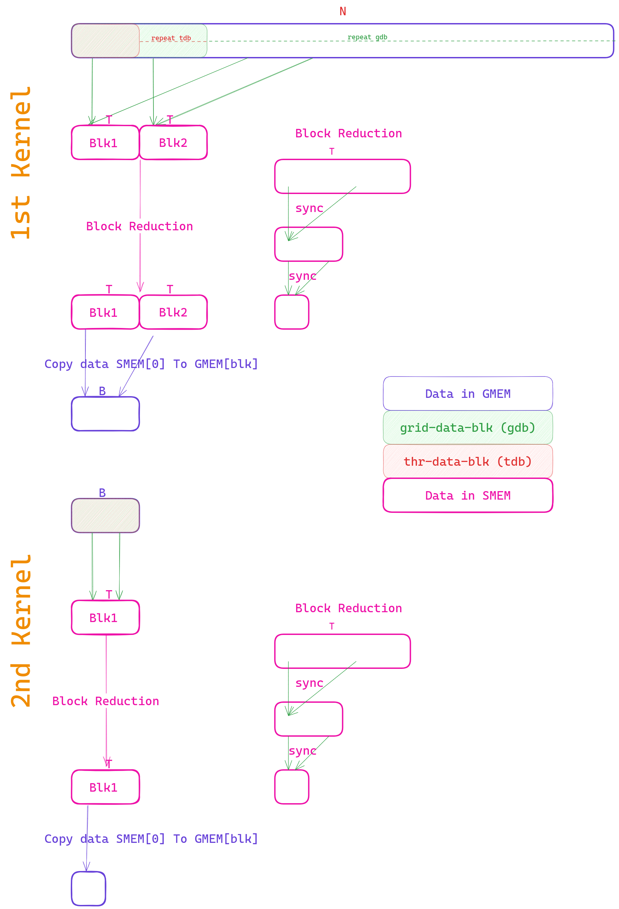

# Iterative Parallel Reduction Algorithms

## Introduction

In parallel computing, reduction operations involve combining elements of a dataset to produce a single result. Iterative parallel reduction algorithms are commonly used to efficiently perform reductions on large datasets in parallel environments, such as GPUs. This documentation outlines two iterative parallel reduction algorithms: the first algorithm utilizes multiple kernels to reduce the dataset iteratively, while the second algorithm employs a single kernel with multiple stages of reduction.

> [!NOTE]  
> Use excalidraw extension in vscode for view the description for each algo in the [docs](docs/Reduction.excalidraw)
> or use [online version](https://excalidraw.com/#json=uDflU_YdY6sXNm9elxcnA,TTUBFYSL-sM9IMbRRO1NCw)

## Algorithm 1: Multi-Kernel Iterative Reduction
Suppose we have the 2^N elements we launch N kernels each time we reduce the half number total number threads.Here we have 2^4 = 16 elements so we launch the 4 kernel and each time we launch half the threads

## Algorithm 2: Single-Kernel Iterative Reduction

## Algorithm 3: Block Reduction

## Algorithm 4: Manual Unrolling
## Algorithm 5: Using Cooperative groups